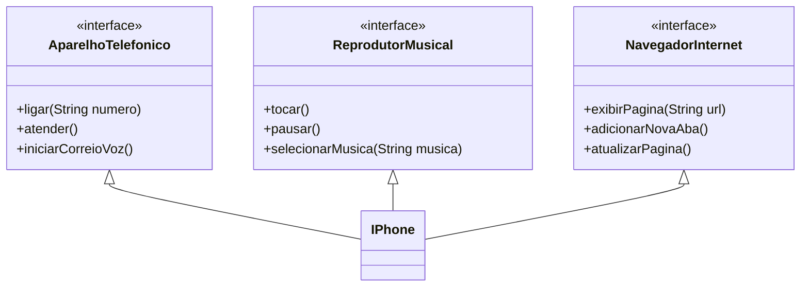

## POO - Desafio

### Diagrama UML (Feito no [Mermaid](https://mermaid.js.org/))

```mermaid
classDiagram
    AparelhoTelefonico <|-- IPhone
    <<interface>> AparelhoTelefonico
    ReprodutorMusical <|-- IPhone
    <<interface>> ReprodutorMusical
    NavegadorInternet <|-- IPhone
    <<interface>> NavegadorInternet

    class AparelhoTelefonico{ 
        +ligar(String numero) 
        +atender()
        +iniciarCorreioVoz()
    }
    
       class ReprodutorMusical {
      +tocar()
      +pausar()
      +selecionarMusica(String musica)
    }
    
     class NavegadorInternet {
      +exibirPagina(String url)
      +adicionarNovaAba()
      +atualizarPagina()
    }

    class IPhone {
    }
```

Diagrama implementado em Java conforme o solicitado pelo safio da DIO.
